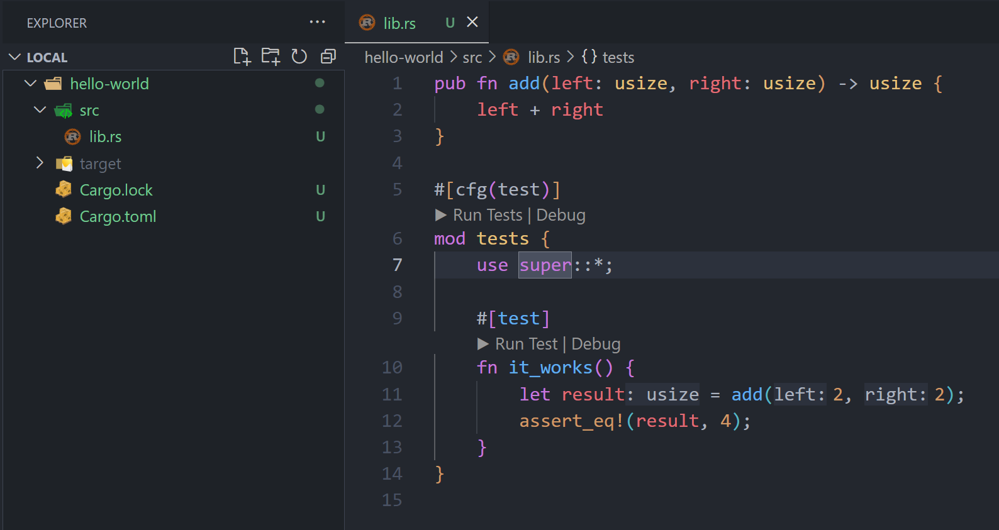
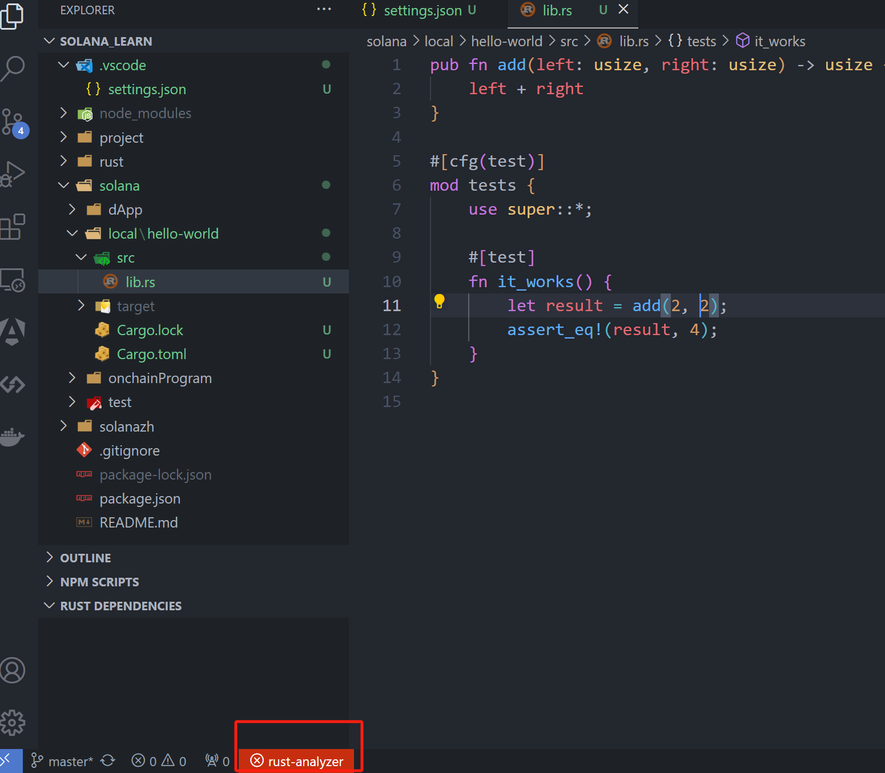

# TL;DR

- 要在本地开始使用 Solana，首先需要安装 **Rust** 和 **Solana CLI**
- 使用 Solana CLI，您可以使用 `solana-test-validator` 命令运行 **本地测试验证节点**
- 安装 Rust 和 Solana CLI 后，您可以使用 `cargo build-bpf` 和 `solana program deploy` 命令在本地构建和部署您的程序
- 您可以使用 `solana logs` 命令查看程序日志

# 概述

在这门课程中，我们迄今为止一直使用 Solana Playground 来开发和部署 Solana 程序。虽然它是一个很好的工具，但对于某些复杂的项目，您可能更喜欢设置一个本地开发环境。这可能是为了使用 Solana Playground 不支持的 crates，充分利用您创建的自定义脚本或工具，或仅仅是出于个人偏好。

有了这个前提，这节课将略有不同。与其详细介绍如何编写程序或与 Solana 网络交互，这节课将主要关注设置本地开发环境这个不那么引人注目的任务。

为了在您的计算机上构建、测试和部署 Solana 程序，您需要安装 Rust 编译器和 Solana 命令行界面 (Command Line Interface，CLI)。我们将首先指导您完成这些安装过程，然后介绍如何使用刚刚安装的工具。

以下是编写时安装 Rust 和 Solana CLI 的步骤。到您阅读此内容时，可能已经有所更改，因此如果遇到问题，请查阅各自的官方安装页面：

- [安装 Rust](https://www.rust-lang.org/tools/install)
- [安装 Solana 工具套件](https://docs.solana.com/cli/install-solana-cli-tools)

## 在 Windows 上设置（使用 Linux）

### 下载 Windows Subsystem for Linux（WSL）

如果您使用的是 Windows 计算机，建议使用 Windows Subsystem for Linux (WSL) 来构建您的 Solana 程序。

打开一个**管理员**权限的 PowerShell 或 Windows 命令提示符，并检查 Windows 版本。

```bash
winver
```

如果您的 Windows 版本是 2004 或更高版本（Build 19041 或更高版本），或者您使用的是 Windows 11，请运行以下命令。

```bash
wsl --install
```

如果您使用的是较旧版本的 Windows，请按照[旧版本 Windows 的说明](https://docs.microsoft.com/en-us/windows/wsl/install-manual)进行操作。

您可以从微软的[安装 WSL 文档](https://docs.microsoft.com/en-us/windows/wsl/install)中了解更多信息。

### 下载 Ubuntu

接下来，[下载 Ubuntu](https://apps.microsoft.com/store/detail/ubuntu-2004/9N6SVWS3RX71?hl=en-us&gl=US)。Ubuntu 提供一个终端，允许您在 Windows 计算机上运行 Linux。这是您将运行 Solana CLI 命令的地方。

### 下载 Rust（用于 WSL）

接下来，在 Ubuntu 终端中打开，并使用以下命令下载适用于 WSL 的 Rust。您可以从[文档中了解更多关于下载 Rust 的信息](https://www.rust-lang.org/learn/get-started)。

```bash
curl --proto '=https' --tlsv1.2 -sSf https://sh.rustup.rs | sh
```

### 下载 Solana CLI

现在我们准备好在 Linux 上下载 Solana CLI 了。在 Ubuntu 终端中运行以下命令。您可以从[文档中了解更多关于下载 Solana CLI 的信息](https://docs.solana.com/cli/install-solana-cli-tools)。

```bash
sh -c "$(curl -sSfL https://release.solana.com/v1.10.31/install)"
```

## 在 macOS 上设置

### 下载 Rust

首先，按照[说明](https://www.rust-lang.org/tools/install)下载 Rust。

### 下载 Solana CLI

接下来，在终端中运行以下命令下载 Solana CLI。

```bash
sh -c "$(curl -sSfL https://release.solana.com/v1.10.31/install)"
```

您可以阅读有关[下载 Solana CLI 的更多信息](https://docs.solana.com/cli/install-solana-cli-tools)。

## Solana CLI 基础知识

Solana CLI 是一个命令行界面工具，提供了一系列用于与 Solana 集群交互的命令。

在本课程中，我们将介绍一些最常见的命令，但您始终可以通过运行 `solana --help` 查看所有可能的 Solana CLI 命令列表。

### Solana CLI 配置

Solana CLI 存储了一些配置设置，这些设置会影响某些命令的行为。您可以使用以下命令查看当前的配置：

```bash
solana config get
```

`solana config get` 命令将返回以下信息：

- `Config File` - Solana CLI 文件在计算机上的位置
- `RPC URL` - 您使用的节点，将您连接到 localhost、Devnet 或 Mainnet
- `WebSocket URL` - 用于监听您所针对的集群事件的 WebSocket（在设置 `RPC URL` 时计算）
- `Keypair Path` - 运行 Solana CLI 子命令时使用的密钥对路径
- `Commitment` - 提供网络确认（confirmation）的度量，并描述区块在某一时刻已最终确认（finalized）的程度

您可以随时使用 `solana config set` 命令，后跟您想要更新的设置，更改 Solana CLI 的配置。

最常见的更改将是针对的集群。使用 `solana config set --url` 命令更改 `RPC URL`。

```bash
solana config set --url localhost
```

```bash
solana config set --url devnet
```

```bash
solana config set --url mainnet-beta
```

类似地，您可以使用 `solana config set --keypair` 命令更改 `Keypair Path`。然后，当运行命令时，Solana CLI 将使用指定路径上的密钥对。

```bash
solana config set --keypair ~/<FILE_PATH>
```

### 测试验证节点

通常，为了进行测试和调试，您会发现运行本地验证节点比部署到 Devnet 更有帮助。

您可以使用 `solana-test-validator` 命令运行本地测试验证器。此命令创建一个持续运行的进程，需要在其自己的命令行窗口中运行。

> 这里如果不启动的话 本地没法运行

### 流式程序日志

通常，同时打开一个新控制台并运行 `solana logs` 命令，可以帮助您观察测试验证节点相关的日志。这将创建另一个持续运行的进程，会流式传输与您配置的集群相关的日志。

如果您的 CLI 配置指向 `localhost`，则日志将始终与您创建的测试验证器相关联（意思是localhost不需要这个），但您也可以从其他集群（如 Devnet 和 Mainnet Beta）中流式传输日志。当从其他集群流式传输日志时，您需要在命令中包含一个程序 ID，以限制您看到的日志仅为特定程序的日志。

### 密钥对

您可以使用 `solana-keygen new --outfile` 命令生成新的密钥对，后跟存储密钥对的文件路径。

```bash
solana-keygen new --outfile ~/<FILE_PATH>
```

有时，您可能需要检查配置指向的是哪个密钥对。要查看在 `solana config` 中设置的当前密钥对的 `publickey`，请使用 `solana address` 命令。

```bash
solana address
```

要查看在 `solana config` 中设置的当前密钥对的 SOL 余额，请使用 `solana balance` 命令。

```bash
solana balance
```

要在 Devnet 或 localhost 上空投 SOL，请使用 `solana airdrop` 命令。请注意，在 Devnet 上，每次空投限制为 2 SOL。

```bash
solana airdrop 2
```

在本地环境中开发和测试程序时，您可能会遇到以下原因导致的错误：

- 使用错误的密钥对
- 没有足够的 SOL 来部署您的程序或执行交易
- 指向错误的集群

到目前为止，我们介绍的 CLI 命令应该可以帮助您迅速解决这些问题。

> 默认的密钥对地址：/root/.config/solana/id.json
>
> 我设置的本地密钥对地址：/root/.config/solana/id_localhost.json

## 在本地环境中开发 Solana 程序

尽管 Solana Playground 非常有帮助，但很难超越您自己的本地开发环境的灵活性。随着您构建更复杂的程序，您可能最终会将它们与在您的本地环境中同样在开发中的一个或多个客户端集成。当您在本地编写、构建和部署程序时，程序和客户端之间的测试通常更简单。

### 创建新项目

要创建一个用于编写 Solana 程序的新 Rust 包，您可以使用 `cargo new --lib` 命令，后跟您想要创建的新目录的名称。

```bash
cargo new --lib <PROJECT_DIRECTORY_NAME>
```

此命令将创建一个新目录，其名称为您在命令末尾指定的名称。这个新目录将包含一个描述该包的 `Cargo.toml` 清单文件（manifest file）。

清单文件包含元数据，如名称、版本和依赖项（crates）。要编写 Solana 程序，您需要更新 `Cargo.toml` 文件，将 `solana-program` 添加为依赖项。您可能还需要添加下面显示的 `[lib]` 和 `crate-type` 行。

```rust
[package]
name = "<PROJECT_DIRECTORY_NAME>"
version = "0.1.0"
edition = "2021"

[features]
no-entrypoint = []

[dependencies]
solana-program = "~1.8.14"

[lib]
crate-type = ["cdylib", "lib"]
```

在这一点上，您可以开始在 `src` 文件夹中编写您的程序。

### 构建和部署

当需要构建您的 Solana 程序时，您可以使用 `cargo build-bpf` 命令。

```bash
cargo build-bpf
```

> 
>
> - 这里得在`wsl` 里运行 然后会自动下载
>
> - 然后发现要`gcc`
>
> - 然后`sudo apt-get update`
> - `sudo apt-get install gcc`  查看 版本`gcc -v`
> - 然后再次运行 `cargo build-bpf`  如果报错 清除缓存`rm -rf ~/.cache/solana/*`再试

该命令的输出将包含部署程序的说明，看起来类似于：

```text
To deploy this program:
  $ solana program deploy /Users/James/Dev/Work/solana-hello-world-local/target/deploy/solana_hello_world_local.so
The program address will default to this keypair (override with --program-id):
  /Users/James/Dev/Work/solana-hello-world-local/target/deploy/solana_hello_world_local-keypair.json
```

当您准备部署程序时，使用 `cargo build-bpf` 输出的 `solana program deploy` 命令。这将把您的程序部署到您 CLI 配置中指定的集群。

```rust
solana program deploy <PATH>
```

>这里在wsl里运行的时候 我们用相对路径 如果我们是在Windows文件目录下打开的话（如果是linux目录下的话就绝对路径）
>solana program deploy hello-world\target\deploy\hello_world.so
>
>root@xrm:/mnt/d/web3_code/solana_learn/solana/local/hello-world/target/deploy# solana program deploy ./hello_world.so

# 实验

让我们通过构建和部署我们在[Hello World 课程](https://github.com/Unboxed-Software/solana-course/pull/content/hello-world-program)中创建的 "Hello World!" 程序来进行实践。

我们将全部在本地进行，包括部署到本地测试验证节点。在开始之前，请确保您已安装了 Rust 和 Solana CLI。如果尚未设置，请参考概述中的说明。

## 1. 创建一个新的 Rust 项目

让我们从创建一个新的 Rust 项目开始。运行下面的 `cargo new --lib` 命令。随意用您自己的目录名称替换。

```bash
cargo new --lib solana-hello-world-local
```

记得更新 `Cargo.toml` 文件，将 `solana-program` 添加为依赖项，并确保 `crate-type` 行已经存在。

```bash
[package]
name = "solana-hello-world-local"
version = "0.1.0"
edition = "2021"

[dependencies]
solana-program = "~1.8.14"

[lib]
crate-type = ["cdylib", "lib"]
```

## 2. 编写您的程序

接下来，使用下面的 “Hello World!” 程序更新 `lib.rs`。当调用程序时，该程序将简单地将 “Hello, world!” 打印到程序日志。

```rust
use solana_program::{
    account_info::AccountInfo,
    entrypoint,
    entrypoint::ProgramResult,
    pubkey::Pubkey,
    msg
};

entrypoint!(process_instruction);

pub fn process_instruction(
    program_id: &Pubkey,
    accounts: &[AccountInfo],
    instruction_data: &[u8]
) -> ProgramResult{
    msg!("Hello, world!");

    Ok(())
}
```

## 3. 运行本地测试验证节点

在编写好您的程序之后，让我们确保我们的 Solana CLI 配置指向 localhost，使用 `solana config set --url` 命令。

```bash
solana config set --url localhost
```

接下来，使用 `solana config get` 命令检查 Solana CLI 配置是否已更新。

```bash
solana config get
```

最后，在一个单独的终端窗口中运行本地测试验证器。运行 `solana-test-validator` 命令。只有当我们的 `RPC URL` 设置为 localhost 时，才需要执行此操作。

```bash
solana-test-validator
```

## 4. 构建和部署

现在我们准备好构建和部署我们的程序了。通过运行 `cargo build-bpf` 命令来构建程序。

```bash
cargo build-bpf
```

现在让我们部署程序。运行 `cargo build-bpf` 输出的 `solana program deploy` 命令。

```bash
solana program deploy <PATH>
```

`solana program deploy` 将输出您的程序的 `Program ID`。您现在可以在[Solana Explorer](https://explorer.solana.com/?cluster=custom)上查找已部署的程序（对于 localhost，请选择 “Custom RPC URL” 作为集群）。

## 5. 查看程序日志

在调用我们的程序之前，打开一个单独的终端，并运行 `solana logs` 命令。这将允许我们在终端中查看程序的日志。

```bash
solana logs <PROGRAM_ID>
```

在测试验证节点仍在运行的情况下，尝试使用[此客户端脚本](https://github.com/Unboxed-Software/solana-hello-world-client)调用您的程序。

在 `index.ts` 中用刚刚部署的程序的程序 ID 替换原有的程序 ID，然后运行 `npm install`，接着运行 `npm start`。这将返回一个 Solana Explorer URL。将该 URL 复制到浏览器中以在 Solana Explorer 上查找交易，并检查是否将 “Hello, world!” 打印到程序日志中。或者，您也可以在运行 `solana logs` 命令的终端中查看程序日志。

就是这样！您刚刚从本地开发环境中创建并部署了您的第一个程序。

# 挑战

现在轮到您独立构建了。尝试创建一个新程序，将您自己的消息打印到程序日志中。这次将您的程序部署到 Devnet，而不是 localhost。

记得使用 `solana config set --url` 命令将您的 `RPC URL` 更新到 Devnet。

您可以使用与实验相同的客户端脚本调用程序，只要将 `connection` 和 Solana Explorer URL 都更新为指向 Devnet 而不是 localhost。

```tsx
let connection = new web3.Connection(web3.clusterApiUrl("devnet"));
```

```tsx
console.log(
    `Transaction: https://explorer.solana.com/tx/${transactionSignature}?cluster=devnet`
);
```

您还可以打开一个单独的命令行窗口，并使用 `solana logs | grep "<PROGRAM_ID> invoke" -A <NUMBER_OF_LINES_TO_RETURN>`。在 Devnet 上使用 `solana logs` 时，必须指定程序 ID。否则，`solana logs` 命令将从 Devnet 返回一系列恒定的日志流。例如，您可以执行以下操作来监视对 Token 程序的调用，并显示每次调用的前 5 行日志：

```bash
solana logs | grep "TokenkegQfeZyiNwAJbNbGKPFXCWuBvf9Ss623VQ5DA invoke" -A 5
```

## 完成实验了吗？

将您的代码推送到 GitHub，然后[告诉我们您对这节课的看法](https://form.typeform.com/to/IPH0UGz7#answers-lesson=aa0b56d6-02a9-4b36-95c0-a817e2c5b19d)！


## 注意

1、 rust项目位置

位置是有讲究的 因为插件可能识别不到 两种方法

- vscode作为二级目录打开 就像：

  - 这样

  - 而不是这样

    

- 设置 手动设置连接 注意路径

  

2. 在用示例代码的时候 因为是之前devnet的代码 所以connection什么的都得改 具体文件在`solana/DApp/hello.ts`里
3. 这一章改了很多东西在前面教程实验什么的都得看 

